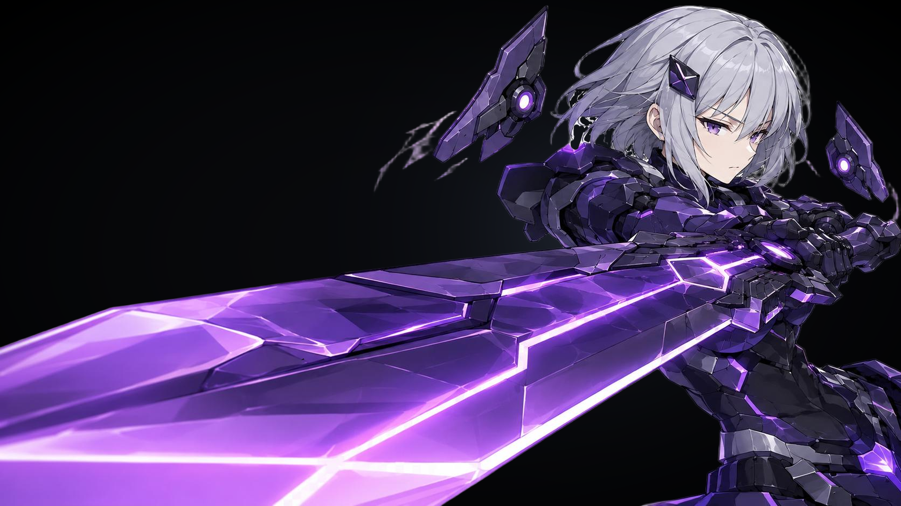

# 奥萝拉 / Aurora

《杀戮尖塔 2》的可玩角色 MOD。一台没有收到停机指令的战争机械——
战斗中不断推高炉温，用濒临过载的机体换取更重的一击。



> 非官方粉丝作品，与 Mega Crit 无关。需要游戏正式版本体。

**[Steam 创意工坊页面](https://steamcommunity.com/sharedfiles/filedetails/?id=3772711396)**

---

## 这个角色是什么

核心是一条**风险条**而不是资源条：**热量**。

打得越狠，炉温越高。进入过载区（7+）全部伤害 ×1.25，
但热量到 10 就会锁定一笔过热伤害在回合末结算——而且**散热不能抹掉已锁定的债**。
每一回合都在回答同一个问题：这一刀值不值得让炉温再涨一格。

围绕它有四条流派：

| 流派 | 回答的问题 |
|---|---|
| **A · 过热暴走** | 我愿意为伤害付出多少血？ |
| **B · 剑势** | 我是现在就打，还是再等一回合？ |
| **C · 悬浮模块** | 我这两个格子放什么？ |
| **D · 指令连锁** | 我这回合的出牌顺序对不对？ |

设计取舍的完整说明见 **[docs/DESIGN.md](docs/DESIGN.md)**。

## 内容量

| | |
|---|---|
| 卡牌 | 98（图鉴显示 94，另 4 张为临时令牌） |
| 专属遗物 | 4 |
| 专属药水 | 2 |
| 专属事件 | 3 |
| 联机专属卡 | 2 |
| 语言 | 简体中文 / English / 日本語 |

角色有完整的 Spine 骨骼动画（战斗 + 选人界面）、自定义能量球、
自定义命中特效，以及全卡池的关键字悬停说明。

---

## 安装

**推荐**：直接订阅上面的创意工坊页面。

**手动**：把 `Aurora.pck`、`Aurora.dll`、`Aurora.json` 放进游戏目录的 `mods/aurora/`。

依赖：

- 《杀戮尖塔 2》 `v0.107.1` 或更高
- [BaseLib](https://steamcommunity.com/sharedfiles/filedetails/?id=3737335127) `v3.3.0` 或更高

> 目前只适配正式版，不适配 beta 分支。原因见 [docs/DESIGN.md](docs/DESIGN.md) §8。

---

## 从源码构建

### 需要什么

- Godot 4.5.1（**mono / .NET 版**）
- .NET SDK 8.0+
- [spine-godot 运行时](https://zh.esotericsoftware.com/spine-godot)
  —— **不包含在本仓库中**，需自行获取，放到 `bin/`
  （`bin/spine_godot_extension.gdextension` 已就位，缺运行时时 Godot 打不开 Spine 资源）

### 构建顺序（不能反）

改了本地化或美术资源，**必须先导 pck、再 build dll**。
因为 headless 导出会触发 Godot 自己的 C# 编译，把已部署的 dll 覆盖掉。

```bash
# 1. 导 pck（游戏必须完全退出）
godot --headless --path . --export-pack "Windows Desktop" Aurora.pck
```

```bash
# 2. build dll
git checkout HEAD -- AuroraMod.csproj AuroraMod.sln
STS2_GAME_DIR="<游戏安装目录>" dotnet build AuroraMod.csproj -c Debug
```

只改 C# 代码的话，第 2 步就够了。

构建应当是 **0 错误**。警告数量取决于 BaseLib 版本
（某些版本会发 2 个 CS0618，正式版上工作正常）——多出来的警告都值得看一眼。

---

## 目录结构

```
AuroraCode/          C# 逻辑
  Cards/             卡牌，按稀有度分目录
  Powers/            能力（含 Heat / Momentum / Chain 等核心机制）
  Relics/  Potions/  Events/
  Helpers/           模块控制器、机制悬停等共用逻辑
  Patches/           Harmony 补丁（含第三方 mod 兼容层）
  Visuals/           命中特效
Aurora/              Godot 资源（进 pck）
  Images/            卡面、图标、特效贴图
  Spine/             骨骼动画
  localization/      zhs / eng / jpn
  Scenes/  Shaders/  Materials/  Audio/
docs/DESIGN.md       设计与维护文档
```

---

## 授权

**双授权**，详见 [LICENSE](LICENSE)：

- **代码** → MIT，随便用
- **美术 / 音频素材** → CC BY-NC-SA 4.0：可以用、可以改，
  但要署名、不得商用、衍生作品保持同协议

游戏本体的一切内容归 Mega Crit 所有，不在本仓库内。

---

## 说明

这是个人兴趣项目，不接受赞助、不做商业化。
欢迎 fork 来做自己的角色——`AuroraCode/Powers/` 里那套自定义机制
（区段化资源条、场上模块、每回合出牌计数）应该是最有参考价值的部分。

提 issue 前建议先读 [docs/DESIGN.md](docs/DESIGN.md) §4「刻意为之，不是 bug」。
